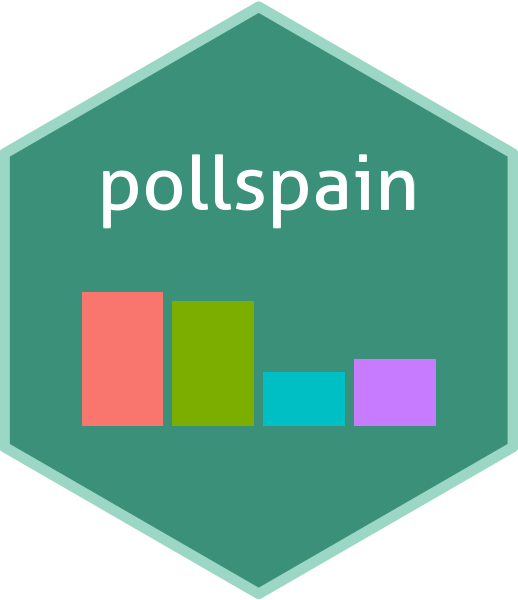

<!-- README.md is generated from README.Rmd. Please edit that file -->


# pollspain 


<!-- badges: start -->
[](https://lifecycle.r-lib.org/articles/stages.html#experimental)
[](https://www.repostatus.org/#active)
[](https://github.com/dadosdelaplace/pollspain/releases)
<!-- badges: end -->

```{r, include = FALSE}
knitr::opts_chunk$set(
  collapse = TRUE,
  comment = "#>",
  fig.path = "man/figures/README-",
  out.width = "100%"
)
```

The main objective of the R package `{pollspain}` is to provide social scientists, political analysts and citizens with easy and straightforward [**access to electoral data from Spain**]{.hl}. This includes both **aggregated election results** extracted from polling stations and **survey data** (including housing effects). It also offers tools for seat allocation, vote simulation, and dataviz. The package is designed under [**tidyverse-style**]{.hl} specially tailored for beginners.

## Installation

You can [**install the development version**]{.hl} from [GitHub](https://github.com/) with:

```{r eval = FALSE}
# install.packages("devtools") # only if not already installed
devtools::install_github("dadosdelaplace/pollspain")
library(pollspain) # after installing
```


```{r message = FALSE, warning = FALSE, echo = FALSE}
library(pollspain)
```

An **internet connection** is just required for installing. Data is stored in the accompanying `pollspaindata` package. **See more** at <https://github.com/dadosdelaplace/pollspaindata>

## Usage

### Election summaries

Using `summary_election_data(type_elec = ..., year = ..., level = ...)` with

* a vector of **election dates** (e.g., `year = 2023` or `date = "2023-07-24"`)
* a vector of **election types** (currently, it only works properly for `type_elec = "congress"`)
* a geographic **level for aggregation** (e.g., `level = "ccaa"` or `level = "prov"`)

returns a [**summary of election results aggregated at the administrative level**]{.hl}. This includes both general data (blank votes, turnout, etc) and **ballots by each candidacy**. The available [**levels**]{.hl} (`level`) are: `"all"`, `"ccaa"` (autonomous communities), `"prov"` (province), `"mun"` (municipality), `"mun_district"` (district), `"sec"` (census tract), and `"poll_station"`.

```{r summary-election-data-1, eval = FALSE}
# Summary election data at ccaa level for both elections in 2023 and 2016
summary_data_all <- summary_election_data(type_elec = "congress", year = 2023)
summary_data_all
```

```{r summary-election-data-1-b, echo = FALSE, warning = FALSE, message = FALSE}
# Summary election data at national level for 2023 election
summary_data_2023 <- summary_election_data(type_elec = "congress", year = 2023)
print(summary_data_2023 |> 
  dplyr::select(id_elec, id_candidacies_nat, ballots,
         blank_ballots, invalid_ballots, party_ballots,porc_candidacies_valid),
  width = Inf)
```

```{r summary-election-data-3, eval = FALSE}
# Summary election data, aggregating candidacies ballots at prov level
summary_data_prov_parties <-
  summary_election_data("congress", year = c(2000, 2008, 2023),
                        level = "prov", by_parties = TRUE)
head(summary_data_prov_parties, 5)
```

```{r summary-election-data-3-b, echo = FALSE, warning = FALSE, message = FALSE, eval = FALSE}
# Summary election data, aggregating candidacies ballots at prov level
# for three elections
summary_data_prov_parties <-
  summary_election_data("congress", year = c(2000, 2008, 2023),
                        level = "prov", by_parties = TRUE)
knitr::kable(head(summary_data_prov_parties, 5))
```

`summary_election_data()` is a **user-friendly combination** of `get_election_data()` (merges different data sources at the polling station level) and `aggregate_election_data()` (aggregates the data). See [**some use cases and tutorials**](https://javieralvarezliebana.es/pollspain/#other-functions).

<details>
<summary>⚠️ About municipalities</summary>

The municipality data (names and codes) were **extracted from the version published by the National Statistics Institute (INE) on February 6, 2025**. The configuration of municipalities from previous years has been adapted to the most recent setup, recoding cases where municipalities have merged or disappeared.

Data extracted from <https://www.ine.es/daco/daco42/codmun/codmun20/20codmun.xlsx>

</details>


<details>
<summary>⚠️ About CERA</summary>

According to the National Statistics Institute (INE) «the electoral roll contains the registration of those who meet the requirements to be voters and are not definitively or temporarily deprived of the right to vote. The electoral roll is composed of:

* The electoral roll of Spanish citizens residing in Spain (CER).
* The **electoral roll of Spanish citizens residing abroad (CERA)**.

The electoral roll of residents in Spain who are nationals of countries with Agreements for municipal elections (CERE Agreements), and the electoral roll of citizens of the European Union residing in Spain for municipal and European Parliament elections (CERE EU)».

Los datos relativos a CERA se han agregado a nivel nacional, comunidad autónoma y provincial. ...

</details>


### Seat allocation


### Surveys summaries


### Estimating electoral surveys


### Simulating electoral results


### Data viz

<!--
* barras ordenadas a más a menos (con colores)
* ggparlament
* encuestas + promedio
* barras con resultados + encuestas encima
* barras con % de voto vs %escaños?
* mapa
* ¿algún lollipop para mostrar housing efects? con flechas y eso.
-->

## Tutorials

## Other functions

`{pollspain}` also provides [**more advanced users with useful functions**]{.hl} to preprocess and analyze electoral data—even their own data, as long as it is provided in a proper format.

* [**Utils**]{.hl}: functions contained in the `utils.R` script are intended to serve as **helper functions for data preprocessing**. See [**more examples and use cases**](https://javieralvarezliebana.es/pollspain/articles/utils.html) about how to use them.

```{r}
type_to_code_election(type_elec = "congress")
extract_code("01-04-003-01-004-B", level = "mun")
extract_code("01-04-003-01-004-B", level = "mun", full_cod = TRUE)
```

* [**Import raw data**]{.hl}: functions starting with `import_..._data()` (code can be found in `import_elections_data.R` file) are aimed at importing and preprocessing as raw as possible the `.DAT` election files from the files available in the [pollspaindata package](https://github.com/dadosdelaplace/pollspaindata). See [**more examples about how to use them**](...).

* [**Recoding candidacies**]{.hl}:

## Contributing

Any contribution is warmly welcome, whether as a **developer or a beta tester** of the package. Please feel free to propose any suggestions by [**opening an issue for discussion**](https://github.com/dadosdelaplace/pollspain/issues).

## References

This package has been designed based on the **following resources and references**

* ACE: The Electoral Knowledge Network. <https://aceproject.org/>
* Albuja J. (2025). R pacakge `{electoral}`: allocating seats methods and party system scores (v0.1.4). <https://cran.r-project.org/web/packages/electoral/index.html>
* García Guzmán P. (2025). WikiBarrio: Explore Spanish socio-demographic data at the neighborhood level. <https://www.wikibarrio.es/>
* García Guzmán P. (2025). ineAtlas: Access to Spanish Household Income Distribution Atlas Data. R package version 0.1.3.9000, <https://github.com/pablogguz/ineAtlas>
* Meleiro H. (2024). infoelectoral: Download Spanish Election Results. R package version 1.0.2, <https://github.com/rOpenSpain/infoelectoral>
* Silge J., Nash J.C., and Graves S. (2018). Navigating the R Package Universe. The R Journal 10 (2): 558–63. <https://doi.org/10.32614/RJ-2018-058>
* V-Dem Dataset. Varieties of Democracy (V-Dem) Project. <https://v-dem.net/data/>
* Wickham H. and Bryan J. R Packages: Organize, Test, Document, and Share Your Code (2023). <https://r-pkgs.org/>

### Data sources

* Spanish electoral data downloaded from [**repository of the Spanish Ministry of the Interior**](https://infoelectoral.interior.gob.es/es/elecciones-celebradas/area-de-descargas/).
* Worldwide electoral data downloaded from [**Comparative Study of Electoral Systems (CSES)**](https://cses.org/data-download/) and [**Election Data Archive (ICPSR)**](https://electiondataarchive.org/)
* Survey data download from Wikipedia links ([**example**](https://en.wikipedia.org/wiki/Opinion_polling_for_the_2023_Spanish_general_election)).
* Seat allocation methods checked in the [**Electoral System Design Database (International IDEA)**](https://www.idea.int/data-tools/data/electoral-system-design)

## Authors

[Javier Álvarez-Liébana (maintainer)](https://javieralvarezliebana.es), David Pereiro-Pol, Mafalda González-González, [Irene Bosque-Gala](https://es.linkedin.com/in/irene-bosque-gala-701271293) and [Mikaela De Smedt](https://www.linkedin.com/in/mikaela-de-smedt-11179020a/?locale=en_US). The development of `{pollspain}` package has been part of several Master's Theses from the Master in Computational Data Science at UC3M (Madrid).

### Usability

The **package’s usability and functionality** have been tested by the following collaborators: 

<details>
<summary>Contributor database</summary>


| Contributor | R knowledge | Political science knowledge | Usability score | Functionality score |
|---------|------|------------|------------|------------|
| ... | 9 | 9 | ... | ... |
| ... | 9 | 2 | ... | ... |
| ... | 5 | 9 | ... | ... |
| ... | 6 | 7 | ... | ... |
| ... | 2 | 3 | ... | ... |
| ... | 6 | 1 | ... | ... |
| ... | 10 | 7 | ... | ... |
| ... | 2 | 8 | ... | ... |
| ... | 5 | 5 | ... | ... |
| ... | 10 | 3 | ... | ... |
| ... | 3 | 9 | ... | ... |
| ... | 9 | 5 | ... | ... |

</details>

